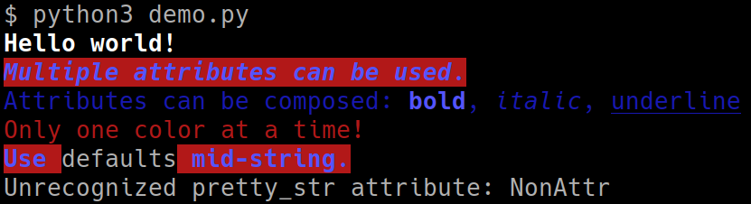

# pretty_str

A python package to format strings for terminal output.

## Installation

To install, clone the git repository, then build the package and install with pip:
```console
$ git clone https://github.com/matyanwek/pretty_str
$ cd pretty_str
$ python3 setup.py bdist_wheel
$ pip3 install .
```

The cloned git directory can then be deleted.

To uninstall, use pip:
```console
$ pip3 uninstall pretty-str
```

## Usage

Import the `pretty_str` function and pass in a string and an attribute:
```python
from src.pretty_str import pretty_str

message1 = pretty_str("Hello world!", "bold")
print(message1)  # bold
```

Multiple attributes can be passed in as an iterable:
```python
attrs = ["bold", "italic", "blue", "bg_red"]
message2 = pretty_str("Multiple attributes can be used.", attrs)
print(message2)  # blue bold-italic on red background
```

Attributes that are not mutually exclusive can be composed:
```python
b = pretty_str("bold", "bold")
i = pretty_str("italic", "italic")
u = pretty_str("underline", "underline")
message3 = pretty_str(f"Attributes can be composed: {b}, {i}, {u}", "blue")
print(message3)  # blue with different faces for each word
```

Attributes that *are* mutually exclusive get overwritten:
```python
message4 = pretty_str("Only one color at a time!", ["blue", "red"])
print(message4)  # red
```

Attributes can be reset with the 'default' attributes:
```python
default_attrs = ["default_face", "default_color", "default_bg_color"]
defaults = pretty_str("defaults", default_attrs)
message5 = pretty_str(f"Use {defaults} mid-string.", ["bold", "blue", "bg_red"])
print(message5)  # blue bold on a red background, with 'hello' as normal
```

Non-existent attributes will raise a ValueError:
```python
try:
    message6 = pretty_str("This sentence will not be printed.", "NonAttr")
except ValueError as error:
    print(error)  # Unrecognized pretty_str attribute: NonAttr
else:
    print(message6)
```

Output of the above code:

